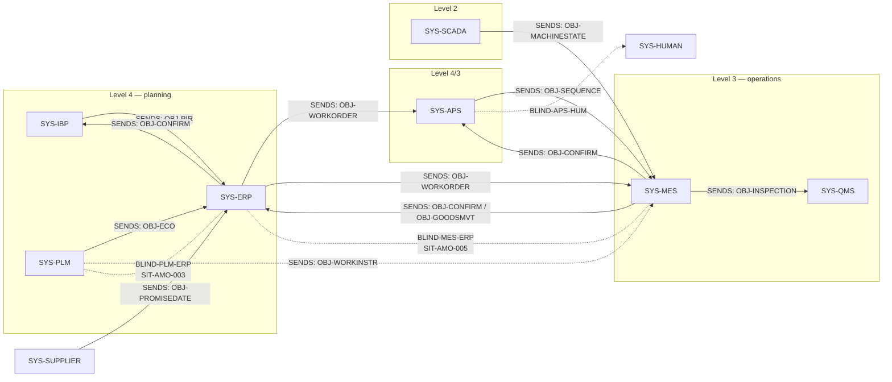

# AMO situations — S&OE decisions where good planners disagree

**AMO — Agentic Manufacturing Orchestration.** This file is the dataset: five
Sales & Operations Execution (S&OE) situation types, plus the reference model of
the plant IT landscape they sit in.

S&OE is the short-horizon cycle where the plan meets what happened on the floor
and someone re-decides — this week, this shift, this order. Every situation here
passes one test: *given the same numbers, would two competent practitioners land
on the same move, or two different defensible ones?* Converge and a solver owns
it; it is not here. Diverge, both defensible, and it is a card.

Nothing is real. No customer data, no real orders, no real plants. Public
vendors (SAP S/4HANA, Siemens Opcenter) are named only to borrow interface
vocabulary and are never reproduced.

## Schema version

`v0.5`. Instance nodes carry a provenance / bitemporal property set (§2.10):
where a fact came from, when the source system believed it (**valid time**), and
when the bench learned it (**transaction time**). A field that fires on a
*change* rather than a state declares a `tracked_transition` (§2.11); a data
object declares whether it is `APPEND_ONLY` or `UPDATABLE` (§2.12). The loader
enforces four assertions over these, all errors.

---

## 2. Card schema

```yaml
id: SIT-AMO-001 | MODEL-AMO-PLANT-IT
domain: AMO
card_type: situation | reference_model
name: short name
```

Reference-model cards use the shape in §3. Situation cards use this:

```yaml
id: SIT-AMO-###
domain: AMO
card_type: situation
name: short situation name

stack_ref: MODEL-AMO-PLANT-IT      # which landscape this card lives in

system_of_record:                   # EVIDENCE — where the context comes from
  source_systems: [system_class, ...]   # drawn from stack_ref's vocabulary
  object_path: A > B > C
  key_fields:
    - field_name: type

entity_refs:                        # canonical instance IDs
  - id: TYPE-###
    type: NodeLabel

edges:                              # object_path as typed relationships
  - from: TYPE-###
    relationship: RELATIONSHIP_NAME
    to: TYPE-###

trigger:
  source:                           # DETECTION — where the signal comes from
    system_class:     ENUM          # from stack_ref
    reference_vendor: string        # optional, public vendors only
    emitting_object:  string        # optional, real API entity or message
    emission_mode:    ENUM          # §2.3
    latency_class:    ENUM          # §2.5
  detectability:      ENUM          # §2.4
  condition: plain-English statement of what fires this situation
  pattern: pseudo-Cypher predicate over entity_refs/edges above

solver_boundary: >                  # what is already solved, and out of scope
  ...

context_features:                   # what the agent sees at decision time
  - feature: description

sample_instance:                    # concrete values satisfying trigger.pattern
  TYPE-###:
    field: value

strategies:                         # 2-5 competing, individually defensible
  - id: S#
    name: ...
    doctrine: one-line description of the action
    preconditions: [what must be true for this to be reasonable]
    trade_off: what it costs or risks
    system_of_action:               # ACTION — where this strategy gets written
      - execution_path: ENUM        # §2.6
        system_class:  ENUM
        endpoint:      string       # optional, real API path where known
        operation:     string
        writes:        [field, ...]
        reversibility: ENUM         # §2.6
        authority:     string
    delegation_ceiling: ENUM        # §2.7 — derived, not authored

qualifier_test:
  practitioner_divergence: yes | no
  rationale: why practitioners would or wouldn't diverge
  classification: judgment | solver
```

### 2.1 Design note — the landscape

Situation cards map onto a discrete-manufacturing landscape:
`Program -> Build -> Module -> WorkOrder -> DependentRequirement -> Part`, with
the plant IT model in §3 supplying the system vocabulary. **No ISA-95 `layer`
field exists on situation cards** — the ISA-95 levels live in the reference
model only, where they belong.


### 2.2 `system_class` vocabulary

Every `system_class` value on a situation card is a **reference to a `:System`
node** in `MODEL-AMO-PLANT-IT`, not a free-text label. On load it must resolve;
an unresolvable value is a load error. That constraint is what keeps the
vocabulary from drifting card by card.

`IBP_SOP` | `PLM_ECM` | `ERP` | `APS` | `MES` | `QMS` | `SCADA_HISTORIAN` |
`SUPPLIER_PORTAL` | `EXTERNAL` | `HUMAN_ROUTINE`


### 2.3 `emission_mode`

`EVENT` · `CADENCE` · `THRESHOLD` · `QUERY` · `EXTERNAL` · `ELAPSED_TIMER` ·
`CONDITION_LAPSE` · `RECOMPUTATION` · `OPPORTUNITY_WINDOW`

### 2.4 `detectability` — the field that decides what to build

| Value | Meaning | Moat implication |
|---|---|---|
| `DIRECT` | A system already raises this. An incumbent alerts on it today. | Low. Re-run the qualifier test — often solver territory. |
| `DERIVED` | Computable from one system's own data, but nobody computes it. | Moderate. Cheap to build, defensible. |
| `ABSENT` | Visible only by comparing two systems, and neither owns the comparison. | High. This is the core value claim stated as a field. |

### 2.5 `latency_class`

`SECONDS` · `MINUTES` · `HOURS` · `NEXT_PLANNING_CYCLE`

The gap between `HOURS` and `NEXT_PLANNING_CYCLE` is where most AMO value sits:
a situation detectable in hours but only surfaced at the next MRP run has
already cost the plant a shift.

### 2.6 `system_of_action`

`execution_path`: `ERP_WRITEBACK` · `NON_ERP_SYSTEM` · `HUMAN_TASK` ·
`SUPPLIER_COMMS` · `NO_ACTION`

`NO_ACTION` is not an omission. "Hold the current plan and absorb the
consequence" is a real, defensible strategy in almost every contention
situation, and it has no endpoint. Encoding the absence explicitly is what stops
it being silently dropped when the action layer gets built.

`reversibility`: `REVERSIBLE` (undone by restoring the prior value) ·
`COMPENSATING_ONLY` (undone only by posting an opposing document — how ERP
confirmations and goods movements actually behave) · `IRREVERSIBLE` (a cancelled
PO, a consumed component, a customer re-commitment, a drawn facility).

### 2.7 `delegation_ceiling` — derived

| Write-path profile | Ceiling |
|---|---|
| All paths system writes, all `REVERSIBLE` | `UNSUPERVISED` reachable |
| Any path `COMPENSATING_ONLY` | `COMMIT_WITH_REVIEW` |
| Any path `IRREVERSIBLE` | `COMMIT_WITH_REVIEW`, higher calibration bar |
| Any path `HUMAN_TASK` or `SUPPLIER_COMMS` | `RECOMMEND` — no endpoint to write to |
| `NO_ACTION` only | `RECOMMEND` |

A well-calibrated agent still cannot be delegated a strategy whose action is a
phone call. That ceiling should fall out of the card, not be decided ad hoc.

### 2.8 Build-order matrix

`detectability` × worst-case `reversibility` across the card's strategies:

|  | All reversible | Any compensating / irreversible |
|---|---|---|
| **`ABSENT`** | **Build first.** Real moat, safe to delegate early. | High value, long Shadow phase. |
| **`DERIVED`** | Build second. Cheap, defensible. | Build when calibration supports it. |
| **`DIRECT`** | Low priority. | Probably not a card. |

### 2.9 Pattern conventions

Every node in every `trigger.pattern` carries `{domain: $domain}`, and `domain`
is passed as a query parameter when a stored pattern runs. One graph instance
can hold more than one domain; the property, enforced inline in every pattern
(not just by an env var), is what keeps a pattern from reaching across one.
Patterns over work orders also carry an explicit status filter — without one
they match closed and cancelled history and degrade as the graph ages.

### 2.10 Provenance and bitemporality on instance nodes

v0.4 modelled the stack in time-free terms. Every `entity_ref` on a situation
card resolved to a node with business fields and no answer to three questions a
trigger frequently needs: which system said this, when did that system believe
it, and when did the bench find out.

Every **extracted** instance node carries the following.

| Property | Type | Required | Definition |
|---|---|---|---|
| `source_system_class` | enum | yes | Must resolve to a `:System` node in the card's `stack_ref`. Same strictness as `system_class` on the card itself — an unresolvable value is a load error |
| `source_system_instance` | string | yes | The specific deployment: `SAP-PRD-100`, `OPCENTER-TLS-01`. A plant with three ERPs has three instance ids against one `system_class` |
| `source_id` | string | yes | Native primary key in the source system, unmodified |
| `source_context` | string | no | Sub-location within the source: table and client, site code, vault |
| `source_valid_from` | datetime | yes | When the source system considers this state to have begun. **Valid time** |
| `source_valid_to` | datetime | no | Null means currently valid in the source. Never set on `APPEND_ONLY` objects — see §2.12 |
| `source_recorded_at` | datetime | yes | When the source system wrote the record |
| `source_actor` | string | no | User or service account in the source. Null where the source does not expose it, which is common |
| `graph_ingested_at` | datetime | yes | When the bench first wrote this node. **Transaction time, open** |
| `graph_updated_at` | datetime | yes | When the bench last modified any property. **Transaction time, close** |
| `graph_path_updated_at` | datetime | no | When an edge incident to this node last changed. Distinct from a property change, and diagnostically different |
| `extraction_run_id` | string | yes | Makes every node traceable to a reproducible pull |

**The two axes, stated plainly.** Valid time is when the fact was true in the
world according to the system that owns it. Transaction time is when the bench
knew it. A trigger that reasons about *lateness of knowledge* rather than
*lateness of the fact* needs both, and cannot be written with one.

`sample_instance` blocks in §4 and §6 now carry the required subset. Full
provenance on every sample would triple the length of every card for no
illustrative gain, so the convention is: **carry provenance on the fields the
trigger actually reads, omit it elsewhere, and never omit it where a trigger
reads a time.**

#### 2.10.1 The representation decision

**Property pair on each node. Not a chain of revision nodes linked by
`SUPERSEDES`.**

Three grounds:

1. **Query simplicity.** A predicate needing "as the source system believed it at
   time T" becomes a property comparison rather than a variable-length path
   traversal. `SIT-AMO-002`'s trigger is unwritable as a readable Cypher clause
   against a revision chain, which is a practical test rather than an aesthetic
   one.
2. **Load simplicity.** An extractor writes a node upsert. A revision chain
   requires the loader to read the current head, decide whether the change is
   material, then write a new node plus an edge — three operations and a race
   condition, per record.
3. **Precedent.** The property-pair shape is what production industrial graph
   platforms operating at very large scale actually use. The revision chain has
   no comparable operating precedent in this domain.

**What is given up.** The property pair holds current and source state. It does
not hold every intermediate value. If a promise date moves from the 3rd to the
10th to the 7th between two extraction runs, the graph holds the 3rd and the
7th. The 10th is lost. Situations reasoning about *plan nervousness* — how many
times a date moved, not where it ended — are not expressible and are out of scope
for this bench. §2.11 is the bounded exception.

**Two further limits, stated so they are not discovered.** Transaction time is
only as fine-grained as the extraction cadence; a daily extractor cannot support
a trigger reasoning about intra-shift knowledge latency. And `source_actor` is
frequently null, because many source systems do not expose the acting user
through the API even where the database holds it. Do not author a trigger that
requires it without confirming availability.

#### 2.10.2 Authored versus extracted nodes

| Node class | Provenance | Note |
|---|---|---|
| `WorkOrder`, `PurchaseOrder`, `POLine`, `Part`, `Supplier`, `Operation`, `Reservation`, `ProductFamily`, `Commitment` | **full set** | |
| `Confirmation` | **full set** | `source_valid_to` always null. Confirmations are append-only; corrections are reversal documents, never edits |
| `EngineeringChange` | **full set** | `source_valid_from` is the **effectivity date**, not the record creation date. The distinction is the entire content of `SIT-AMO-003`, and reading the wrong one inverts the trigger |
| `System`, `DataObject`, `BusinessProcess`, `Standard`, `BlindSpot` | **none** | Reference-model nodes. Authored, not extracted |
| `SituationType`, `Strategy`, `ActionPath` | **none** | Authored. Versioned by the repository, not by the graph |

**The rule:** authored nodes are versioned in Git and carry no provenance
properties. Extracted nodes are versioned in the graph and carry the full set.
A node class that is sometimes authored and sometimes extracted is a modelling
error — split it.

### 2.11 `tracked_transitions` — the bounded exception

§2.10.1 gives up intermediate history. That is acceptable everywhere except one
place: a trigger whose condition is *a change*, not a state.

`SIT-AMO-002` fires on a supplier pushing a promise date. v0.4 handled this by
putting `original_promise_date` and `revised_promise_date` as two fields on one
node — an ad-hoc bitemporal representation, undeclared, holding exactly one
revision, with no record of when the revision arrived.

Declare it instead.

```yaml
tracked_transitions:                # on the situation card
  - node_type: POLine
    field: promise_date
    retains: 1                      # exactly one prior value. Not a history
```

A tracked field carries three properties on the node rather than one:

| Property | Meaning |
|---|---|
| `promise_date` | the current value |
| `promise_date_prior` | the immediately preceding value, or null if never changed |
| `promise_date_changed_at` | transaction time of the change — when the bench observed it, not when the source believed it |

`retains: 1` is a hard bound, not a default. Anything above one is a revision
chain wearing a different name and is rejected at load. A card needing full
movement history is describing plan nervousness and is out of scope (§2.10.1).

**What this buys and what it does not.** It makes "the date moved and the move
consumed the buffer" expressible in one readable clause. It does not make "the
date has moved three times this quarter" expressible, and a card must not imply
otherwise.

### 2.12 `write_semantics` — and why it is on the object, not the system

`APPEND_ONLY` · `UPDATABLE`

Declared on `:DataObject` nodes in the reference model. Where an object does not
declare one, it inherits `default_write_semantics` from the system that
`MASTERS` it.

**It belongs on the object because `ERP` is both.** SAP masters work orders,
whose dates are updated in place, and goods movements and confirmations, which
are append-only with reversal documents. A single value on `:System` forces a
wrong answer for the most important system in the model.

Three consequences the loader enforces:

- On an `APPEND_ONLY` object, **never set `source_valid_to`.** A correction is a
  new node with its own `source_valid_from`, linked by `:REVERSES`.
- The current state of a confirmed quantity is therefore a **sum over unreversed
  nodes**, not the value on the latest node. A trigger reading "the latest
  confirmation" is wrong precisely when a correction has been posted, which is
  when the situation is most sensitive.
- A loader that closes `source_valid_to` on an append-only object has silently
  converted a compensating correction into an edit, and destroyed the audit trail
  that `reversibility: COMPENSATING_ONLY` (§2.6) depends on. That makes the
  delegation ceiling derived in §2.7 unsound rather than merely wrong.

---

## 3. Reference model — the manufacturing plant IT landscape

```yaml
id: MODEL-AMO-PLANT-IT
domain: AMO
card_type: reference_model
name: Discrete manufacturing plant IT model

purpose: >
  The shared landscape every AMO situation card refers to. Defines the system
  classes, what each one emits, what each one accepts as a write, and the
  interfaces between them — so that trigger.source, system_of_record and
  system_of_action all draw on one vocabulary instead of restating it per card.

reference_stack:                    # a representative real-world instantiation
  ERP:  SAP S/4HANA
  MES:  Siemens Opcenter Execution
  PLM:  Siemens Teamcenter
  IBP:  SAP IBP
  note: >
    Named only to anchor interface vocabulary. SAP's OData services are publicly
    documented; Opcenter's REST reference ships with the installed instance and
    is not public, so MES-side message shapes below are authored, not cited.

systems:
  - system_class: IBP_SOP
    isa95_level: 4
    role: demand plan, constrained supply plan, S&OP cycle
    emits: [planned independent requirement, constrained supply plan]
    accepts_writes: [actual consumption, capacity consumed, cost actuals]
    latency: NEXT_PLANNING_CYCLE

  - system_class: PLM_ECM
    isa95_level: 4
    default_write_semantics: UPDATABLE
    role: product definition, EBOM, engineering change control, work instructions
    emits: [engineering change record, EBOM release, effectivity date, work instruction revision]
    accepts_writes: [as-built configuration, deviation and concession records]
    latency: HOURS
    key_identifier: ecm_change_id

  - system_class: ERP
    isa95_level: 4
    default_write_semantics: UPDATABLE      # per-object overrides below; see §2.12
    isa95_level_note: >
      ERP is the reason write_semantics sits on the DataObject rather than here.
      It masters both updatable objects (work order dates) and append-only ones
      (goods movements, confirmations). A single system-level value is wrong.
    role: MPS, MRP, MBOM, routing, inventory, purchasing, costing
    emits: [planned order, production order, purchase order, reservation, MBOM explosion]
    accepts_writes: [order create/release/reschedule, confirmation, goods movement]
    latency: NEXT_PLANNING_CYCLE
    key_identifiers: [mrp_run_id, erp_transaction_id]
    note: >
      MRP itself runs as a background job, not an API action. You read its
      output; you rarely trigger it.

  - system_class: APS
    isa95_level: 4/3 boundary
    default_write_semantics: UPDATABLE
    role: finite-capacity scheduling, sequencing, changeover optimisation
    emits: [committed sequence, feasibility violation, capacity shortfall]
    accepts_writes: [priority override, resource calendar extension, forced sequence]
    latency: MINUTES
    key_identifier: aps_sequence_id
    note: >
      The only system in the landscape whose function is choosing among futures
      rather than recording facts. Present as a human scheduler where no tool
      exists.

  - system_class: MES
    isa95_level: 3
    default_write_semantics: APPEND_ONLY
    role: dispatch, traveler, labour and machine capture, in-process quality, genealogy
    emits: [operation confirmation, yield, scrap, downtime, nonconformance, genealogy]
    accepts_writes: [work order dispatch, priority, work instruction reference]
    latency: MINUTES
    key_identifier: mes_run_id
    note: >
      Dual-role. Not only a downstream consumer — its confirmations generate
      supply (goods receipt) and consume it (backflush), which feeds the next
      MRP run.

  - system_class: QMS
    isa95_level: 3
    default_write_semantics: APPEND_ONLY
    role: inspection plans, nonconformance, CAPA, supplier quality, audit
    emits: [inspection result, nonconformance record, disposition]
    accepts_writes: [disposition decision, deviation approval]
    latency: HOURS

  - system_class: SCADA_HISTORIAN
    isa95_level: 2
    role: process data, machine state, downtime reason capture
    emits: [machine state change, process variable, downtime reason code]
    accepts_writes: [setpoint]
    latency: SECONDS

  - system_class: SUPPLIER_PORTAL
    isa95_level: 4 (external)
    default_write_semantics: UPDATABLE
    role: supplier confirmation, promise date changes, ASN
    emits: [promise date revision, advance shipping notice, non-confirmation]
    accepts_writes: [expedite request, schedule agreement change]
    latency: HOURS

  - system_class: HUMAN_ROUTINE
    isa95_level: n/a
    role: >
      Decisions taken in a recurring human rhythm with no system of record —
      clear-to-build review, daily tiering, supplier negotiation, customer
      re-commitment, overtime authorisation.
    emits: [nothing queryable]
    accepts_writes: [nothing — this is why delegation_ceiling caps at RECOMMEND]
    latency: HOURS

interfaces:
  - from: IBP_SOP
    to: ERP
    carries: planned independent requirements seeding the MPS
    cadence: CADENCE
  - from: PLM_ECM
    to: ERP
    carries: EBOM release and ECO effectivity, becoming MBOM and routing
    cadence: EVENT
    note: >
      The MBOM/EBOM seam. An engineering-usage change with no matching
      production-usage change is invisible to MRP and to the traveler at the
      same time. See SIT-AMO-003.
  - from: PLM_ECM
    to: MES
    carries: current-revision work instruction and inspection plan at point of use
    cadence: QUERY
  - from: ERP
    to: APS
    carries: released order queue, due dates, priority
    cadence: EVENT
  - from: APS
    to: MES
    carries: sequenced operation queue per work centre
    cadence: CADENCE
  - from: ERP
    to: MES
    carries: released work order — header, routing operations, component reservations
    cadence: EVENT
  - from: MES
    to: ERP
    carries: operation confirmations, backflush, goods receipt, scrap
    cadence: EVENT
    note: >
      Append-only. Corrections are reversal documents, not edits — which is why
      most MES-to-ERP writes are COMPENSATING_ONLY, never REVERSIBLE.
  - from: MES
    to: APS
    carries: actual progress and downtime — the signal that triggers re-sequencing
    cadence: EVENT
  - from: ERP
    to: IBP_SOP
    carries: actual consumption, cost, capacity consumed
    cadence: CADENCE

known_blind_spots:                  # where detectability is ABSENT by construction
  - between: [PLM_ECM, ERP]
    gap: no system compares ECO effectivity against already-released orders
    card: SIT-AMO-003
  - between: [APS, HUMAN_ROUTINE]
    gap: >
      the solver reports infeasibility; nothing arbitrates between commitments
      when no feasible option satisfies all of them
    card: SIT-AMO-004
  - between: [MES, ERP]
    gap: >
      MES knows delivered quantity, ERP knows planned quantity, and no message
      carries the delta against the customer commitment
    card: SIT-AMO-005

# ---------------------------------------------------------------------------
# The stack as a graph. Everything above is specification; everything below is
# loadable. Same discipline the situation cards already carry: canonical node
# ids, typed edges, one line per hop.
# ---------------------------------------------------------------------------

node_classes:
  - label: System
    description: an application in the plant landscape
  - label: DataObject
    description: a business object one or more systems master, emit or accept
  - label: BusinessProcess
    description: a named process the systems execute between them
  - label: Standard
    description: an interoperability standard or protocol a system conforms to

entity_refs:
  # Systems
  - {id: SYS-IBP,      type: System,          system_class: IBP_SOP,         isa95_level: 4}
  - {id: SYS-PLM,      type: System,          system_class: PLM_ECM,         isa95_level: 4}
  - {id: SYS-ERP,      type: System,          system_class: ERP,             isa95_level: 4}
  - {id: SYS-APS,      type: System,          system_class: APS,             isa95_level: 4/3}
  - {id: SYS-MES,      type: System,          system_class: MES,             isa95_level: 3}
  - {id: SYS-QMS,      type: System,          system_class: QMS,             isa95_level: 3}
  - {id: SYS-SCADA,    type: System,          system_class: SCADA_HISTORIAN, isa95_level: 2}
  - {id: SYS-SUPPLIER, type: System,          system_class: SUPPLIER_PORTAL, isa95_level: 4}
  - {id: SYS-HUMAN,    type: System,          system_class: HUMAN_ROUTINE,   isa95_level: null}

  # Data objects — write_semantics per §2.12. APPEND_ONLY objects must never
  # have source_valid_to set; corrections are new nodes linked by :REVERSES.
  - {id: OBJ-PIR,        type: DataObject, name: Planned independent requirement, write_semantics: UPDATABLE}
  - {id: OBJ-EBOM,       type: DataObject, name: Engineering BOM,                 write_semantics: UPDATABLE}
  - {id: OBJ-MBOM,       type: DataObject, name: Manufacturing BOM,               write_semantics: UPDATABLE}
  - {id: OBJ-ECO,        type: DataObject, name: Engineering change record,       write_semantics: UPDATABLE}
  - {id: OBJ-ROUTING,    type: DataObject, name: Routing,                         write_semantics: UPDATABLE}
  - {id: OBJ-WORKINSTR,  type: DataObject, name: Work instruction,                write_semantics: UPDATABLE}
  - {id: OBJ-PLANNEDORD, type: DataObject, name: Planned order,                   write_semantics: UPDATABLE}
  - {id: OBJ-WORKORDER,  type: DataObject, name: Work order,                      write_semantics: UPDATABLE}
  - {id: OBJ-PO,         type: DataObject, name: Purchase order,                  write_semantics: UPDATABLE}
  - {id: OBJ-RESERVATION,type: DataObject, name: Component reservation,           write_semantics: UPDATABLE}
  - {id: OBJ-SEQUENCE,   type: DataObject, name: Committed sequence,              write_semantics: UPDATABLE}
  - {id: OBJ-CONFIRM,    type: DataObject, name: Operation confirmation,          write_semantics: APPEND_ONLY}
  - {id: OBJ-GOODSMVT,   type: DataObject, name: Goods movement,                  write_semantics: APPEND_ONLY}
  - {id: OBJ-INSPECTION, type: DataObject, name: Inspection result,               write_semantics: APPEND_ONLY}
  - {id: OBJ-NCR,        type: DataObject, name: Nonconformance record,           write_semantics: APPEND_ONLY}
  - {id: OBJ-MACHINESTATE,type: DataObject,name: Machine state,                   write_semantics: APPEND_ONLY}
  - {id: OBJ-PROMISEDATE,type: DataObject, name: Supplier promise date,           write_semantics: UPDATABLE, tracked: true}
  - {id: OBJ-GENEALOGY,  type: DataObject, name: As-built genealogy,              write_semantics: APPEND_ONLY}

  # Business processes
  - {id: BP-SOP,        type: BusinessProcess, name: Sales and operations planning}
  - {id: BP-ECC,        type: BusinessProcess, name: Engineering change control}
  - {id: BP-MRP,        type: BusinessProcess, name: Material requirements planning}
  - {id: BP-PROCURE,    type: BusinessProcess, name: Material procurement}
  - {id: BP-SCHEDULE,   type: BusinessProcess, name: Production scheduling}
  - {id: BP-EXECUTE,    type: BusinessProcess, name: Shop floor execution}
  - {id: BP-QUALITY,    type: BusinessProcess, name: Quality control}
  - {id: BP-COSTING,    type: BusinessProcess, name: Job costing and settlement}

  # Standards
  - {id: STD-ISA95,  type: Standard, name: ISA-95}
  - {id: STD-B2MML,  type: Standard, name: B2MML}
  - {id: STD-OPCUA,  type: Standard, name: OPC UA}
  - {id: STD-MQTT,   type: Standard, name: MQTT}
  - {id: STD-ODATA,  type: Standard, name: OData / REST}

edges:
  # --- System EXECUTES BusinessProcess -------------------------------------
  - {from: SYS-IBP,      relationship: EXECUTES, to: BP-SOP}
  - {from: SYS-PLM,      relationship: EXECUTES, to: BP-ECC}
  - {from: SYS-ERP,      relationship: EXECUTES, to: BP-MRP}
  - {from: SYS-ERP,      relationship: EXECUTES, to: BP-PROCURE}
  - {from: SYS-ERP,      relationship: EXECUTES, to: BP-COSTING}
  - {from: SYS-APS,      relationship: EXECUTES, to: BP-SCHEDULE}
  - {from: SYS-MES,      relationship: EXECUTES, to: BP-EXECUTE}
  - {from: SYS-QMS,      relationship: EXECUTES, to: BP-QUALITY}
  - {from: SYS-HUMAN,    relationship: EXECUTES, to: BP-SCHEDULE}

  # --- System MASTERS DataObject (system of record) ------------------------
  - {from: SYS-PLM, relationship: MASTERS, to: OBJ-EBOM}
  - {from: SYS-PLM, relationship: MASTERS, to: OBJ-ECO}
  - {from: SYS-PLM, relationship: MASTERS, to: OBJ-WORKINSTR}
  - {from: SYS-ERP, relationship: MASTERS, to: OBJ-MBOM}
  - {from: SYS-ERP, relationship: MASTERS, to: OBJ-ROUTING}
  - {from: SYS-ERP, relationship: MASTERS, to: OBJ-WORKORDER}
  - {from: SYS-ERP, relationship: MASTERS, to: OBJ-PO}
  - {from: SYS-ERP, relationship: MASTERS, to: OBJ-RESERVATION}
  - {from: SYS-APS, relationship: MASTERS, to: OBJ-SEQUENCE}
  - {from: SYS-MES, relationship: MASTERS, to: OBJ-CONFIRM}
  - {from: SYS-MES, relationship: MASTERS, to: OBJ-GENEALOGY}
  - {from: SYS-QMS, relationship: MASTERS, to: OBJ-NCR}
  - {from: SYS-SCADA, relationship: MASTERS, to: OBJ-MACHINESTATE}
  - {from: SYS-SUPPLIER, relationship: MASTERS, to: OBJ-PROMISEDATE}

  # --- BusinessProcess CONSUMES / PRODUCES DataObject ----------------------
  - {from: BP-SOP,      relationship: PRODUCES, to: OBJ-PIR}
  - {from: BP-MRP,      relationship: CONSUMES, to: OBJ-PIR}
  - {from: BP-MRP,      relationship: CONSUMES, to: OBJ-MBOM}
  - {from: BP-MRP,      relationship: PRODUCES, to: OBJ-PLANNEDORD}
  - {from: BP-MRP,      relationship: PRODUCES, to: OBJ-RESERVATION}
  - {from: BP-PROCURE,  relationship: CONSUMES, to: OBJ-PLANNEDORD}
  - {from: BP-PROCURE,  relationship: PRODUCES, to: OBJ-PO}
  - {from: BP-ECC,      relationship: PRODUCES, to: OBJ-ECO}
  - {from: BP-ECC,      relationship: CONSUMES, to: OBJ-EBOM}
  - {from: BP-SCHEDULE, relationship: CONSUMES, to: OBJ-WORKORDER}
  - {from: BP-SCHEDULE, relationship: PRODUCES, to: OBJ-SEQUENCE}
  - {from: BP-EXECUTE,  relationship: CONSUMES, to: OBJ-SEQUENCE}
  - {from: BP-EXECUTE,  relationship: CONSUMES, to: OBJ-WORKINSTR}
  - {from: BP-EXECUTE,  relationship: PRODUCES, to: OBJ-CONFIRM}
  - {from: BP-EXECUTE,  relationship: PRODUCES, to: OBJ-GOODSMVT}
  - {from: BP-EXECUTE,  relationship: PRODUCES, to: OBJ-GENEALOGY}
  - {from: BP-QUALITY,  relationship: PRODUCES, to: OBJ-INSPECTION}
  - {from: BP-QUALITY,  relationship: PRODUCES, to: OBJ-NCR}
  - {from: BP-COSTING,  relationship: CONSUMES, to: OBJ-CONFIRM}
  - {from: BP-COSTING,  relationship: CONSUMES, to: OBJ-GOODSMVT}

  # --- System SENDS DataObject TO System -----------------------------------
  # modelled as a reified :Interface so cadence and contract are queryable
  - {from: SYS-IBP,  relationship: SENDS, to: SYS-ERP,  carries: OBJ-PIR,        cadence: CADENCE}
  - {from: SYS-PLM,  relationship: SENDS, to: SYS-ERP,  carries: OBJ-ECO,        cadence: EVENT}
  - {from: SYS-PLM,  relationship: SENDS, to: SYS-MES,  carries: OBJ-WORKINSTR,  cadence: QUERY}
  - {from: SYS-ERP,  relationship: SENDS, to: SYS-APS,  carries: OBJ-WORKORDER,  cadence: EVENT}
  - {from: SYS-APS,  relationship: SENDS, to: SYS-MES,  carries: OBJ-SEQUENCE,   cadence: CADENCE}
  - {from: SYS-ERP,  relationship: SENDS, to: SYS-MES,  carries: OBJ-WORKORDER,  cadence: EVENT}
  - {from: SYS-MES,  relationship: SENDS, to: SYS-ERP,  carries: OBJ-CONFIRM,    cadence: EVENT}
  - {from: SYS-MES,  relationship: SENDS, to: SYS-ERP,  carries: OBJ-GOODSMVT,   cadence: EVENT}
  - {from: SYS-MES,  relationship: SENDS, to: SYS-APS,  carries: OBJ-CONFIRM,    cadence: EVENT}
  - {from: SYS-MES,  relationship: SENDS, to: SYS-QMS,  carries: OBJ-INSPECTION, cadence: EVENT}
  - {from: SYS-SCADA,relationship: SENDS, to: SYS-MES,  carries: OBJ-MACHINESTATE,cadence: EVENT}
  - {from: SYS-SUPPLIER, relationship: SENDS, to: SYS-ERP, carries: OBJ-PROMISEDATE, cadence: EVENT}
  - {from: SYS-ERP,  relationship: SENDS, to: SYS-IBP,  carries: OBJ-CONFIRM,    cadence: CADENCE}

  # --- System COMPLIES_WITH Standard ---------------------------------------
  - {from: SYS-ERP,   relationship: COMPLIES_WITH, to: STD-ODATA}
  - {from: SYS-ERP,   relationship: COMPLIES_WITH, to: STD-ISA95}
  - {from: SYS-MES,   relationship: COMPLIES_WITH, to: STD-ISA95}
  - {from: SYS-MES,   relationship: COMPLIES_WITH, to: STD-B2MML}
  - {from: SYS-APS,   relationship: COMPLIES_WITH, to: STD-ISA95}
  - {from: SYS-SCADA, relationship: COMPLIES_WITH, to: STD-OPCUA}
  - {from: SYS-SCADA, relationship: COMPLIES_WITH, to: STD-MQTT}

  # --- BlindSpot nodes, reified so situation cards can point at them --------
  - {from: BLIND-PLM-ERP, relationship: BETWEEN, to: SYS-PLM}
  - {from: BLIND-PLM-ERP, relationship: BETWEEN, to: SYS-ERP}
  - {from: BLIND-APS-HUM, relationship: BETWEEN, to: SYS-APS}
  - {from: BLIND-APS-HUM, relationship: BETWEEN, to: SYS-HUMAN}
  - {from: BLIND-MES-ERP, relationship: BETWEEN, to: SYS-MES}
  - {from: BLIND-MES-ERP, relationship: BETWEEN, to: SYS-ERP}

join_to_situation_cards: >
  This is the point of making the stack a graph rather than a table. Once
  loaded, the string enums on situation cards resolve to real nodes, and the
  bench becomes traversable in one query instead of two lookups joined by hand:

    (:SituationType)-[:DETECTED_BY]->(:System)     from trigger.source.system_class
    (:SituationType)-[:EVIDENCED_BY]->(:System)    from system_of_record.source_systems
    (:SituationType)-[:COVERS]->(:BlindSpot)       from known_blind_spots.card
    (:Strategy)-[:ACTS_ON]->(:System)              from system_of_action[].system_class
    (:Strategy)-[:WRITES]->(:DataObject)           from system_of_action[].writes

  Loader rule: every system_class value on every card MUST resolve to a
  :System node in this model. An unresolvable value is a load error, not a
  warning — that constraint is what stops the vocabulary drifting card by card,
  which is exactly what happened between v0.1 and v0.2.

queries_this_enables:
  - name: Which systems does a situation span?
    cypher: |
      MATCH (s:SituationType {id: 'SIT-AMO-005', domain: $domain})
      OPTIONAL MATCH (s)-[:DETECTED_BY]->(d:System)
      OPTIONAL MATCH (s)-[:EVIDENCED_BY]->(e:System)
      OPTIONAL MATCH (s)-[:HAS_STRATEGY]->(:Strategy)-[:ACTS_ON]->(a:System)
      RETURN d.system_class AS detects,
             collect(DISTINCT e.system_class) AS evidence,
             collect(DISTINCT a.system_class) AS acts_on

  - name: Which systems must be connected before a card can run at all?
    cypher: |
      MATCH (s:SituationType {domain: $domain})-[:EVIDENCED_BY|DETECTED_BY]->(sys:System)
      RETURN sys.system_class AS system, collect(s.id) AS cards_blocked_without_it
      ORDER BY size(cards_blocked_without_it) DESC
    note: >
      This is the onboarding sequencing query. It answers "which connector do we
      build first" from the card set rather than from opinion.

  - name: Where does a situation detected in one system get acted on in another?
    cypher: |
      MATCH (s:SituationType {domain: $domain})-[:DETECTED_BY]->(d:System),
            (s)-[:HAS_STRATEGY]->(st:Strategy)-[:ACTS_ON]->(a:System)
      WHERE d <> a
      RETURN s.id, d.system_class AS detected_in, a.system_class AS acted_in,
             st.id AS strategy
    note: >
      Every row is a cross-system enforcement path — the Layer 4 scope. If this
      returns few rows, the bench is describing single-system problems that the
      incumbent probably already owns.
```

### 3.1 Reading the stack graph



The three dotted blind-spot links are the whole argument in one picture: they
are not missing interfaces, they are places where two systems each hold half a
fact and no message carries the comparison. Every `detectability: ABSENT` card
in §4 sits on one of them.

---

## 4. Situations

### SIT-AMO-001 — Scarce common part contention

```yaml
id: SIT-AMO-001
domain: AMO
card_type: situation
name: Scarce common part contention
stack_ref: MODEL-AMO-PLANT-IT

system_of_record:
  source_systems: [ERP, MES]
  object_path: Program > Build > WorkOrder > DependentRequirement > Part
  key_fields:
    - work_order_id: string
    - part_number: string
    - bom_level: integer
    - required_qty: number
    - available_qty: number
    - incoming_qty: number
    - need_date: date
    - customer_tier: enum [A, B, C]
    - projected_availability_date: date

entity_refs:
  - id: PROG-31
    type: Program
  - id: BUILD-A
    type: Build
  - id: WO-4471
    type: WorkOrder
  - id: WO-4482
    type: WorkOrder
  - id: PART-XR200
    type: Part

edges:
  - from: PROG-31
    relationship: CONTAINS
    to: BUILD-A
  - from: BUILD-A
    relationship: CONTAINS
    to: WO-4471
  - from: BUILD-A
    relationship: CONTAINS
    to: WO-4482
  - from: WO-4471
    relationship: REQUIRES
    to: PART-XR200
  - from: WO-4482
    relationship: REQUIRES
    to: PART-XR200

trigger:
  source:
    system_class:  ERP
    emission_mode: RECOMPUTATION
    latency_class: NEXT_PLANNING_CYCLE
  detectability: DERIVED
  condition: two or more open work orders require the same part number; projected
    availability on-hand-plus-incoming is less than the sum of their required quantities
  pattern: |
    MATCH (p:Part {domain: $domain})<-[:REQUIRES]-(w:WorkOrder {domain: $domain})
    WHERE w.status IN ['released', 'in_progress']
    WITH p, collect(w) AS wos, sum(w.required_qty) AS total_required
    WHERE size(wos) >= 2
      AND p.available_qty + p.incoming_qty < total_required
    RETURN p, wos

solver_boundary: >
  Netting one item's supply against total demand is solved — MRP does it
  correctly every run. What is not solved, and not attempted, is allocation
  between two competing consumers of the same shortfall: MRP's output shape is
  one net requirement per item per period, which structurally cannot express a
  contention between WO-4471 and WO-4482.

context_features:
  - feature: relative need dates of the competing work orders
  - feature: customer tier and contractual penalty exposure attached to each work order
  - feature: whether a substitute or superseding part number is qualified
  - feature: cost and lead time of an expedite on the shortfall

sample_instance:                    # provenance per §2.10 (repo pass) — AMO
  PART-XR200:
    available_qty: 25
    incoming_qty: 0
    source_system_class: ERP
    source_system_instance: SAP-PRD-100
    source_id: "MATL/XR200/PLANT-1000"
    source_valid_from: 2026-09-06T02:00:00Z      # last MRP recompute
    source_valid_to: null
    source_recorded_at: 2026-09-06T02:14:00Z
    graph_ingested_at: 2026-07-02T03:00:00Z
    graph_updated_at: 2026-09-06T06:10:00Z
    extraction_run_id: RUN-2026-09-07-0600
  WO-4471:
    required_qty: 40
    need_date: 2026-09-10
    customer_tier: A
    status: released
    source_system_class: ERP
    source_system_instance: SAP-PRD-100
    source_id: "AUFK/000040001471"
    source_valid_from: 2026-08-24T00:00:00Z
    source_valid_to: null
    source_recorded_at: 2026-08-24T09:31:00Z
    graph_ingested_at: 2026-07-02T03:00:00Z
    graph_updated_at: 2026-09-06T06:10:00Z
    extraction_run_id: RUN-2026-09-07-0600
  WO-4482:
    required_qty: 15
    need_date: 2026-09-12
    customer_tier: B
    status: released
    source_system_class: ERP
    source_system_instance: SAP-PRD-100
    source_id: "AUFK/000040001482"
    source_valid_from: 2026-08-25T00:00:00Z
    source_valid_to: null
    source_recorded_at: 2026-08-25T10:05:00Z
    graph_ingested_at: 2026-07-02T03:00:00Z
    graph_updated_at: 2026-09-06T06:10:00Z
    extraction_run_id: RUN-2026-09-07-0600
  # 25 + 0 < 40 + 15  ->  pattern fires

strategies:
  - id: S1
    name: Allocate to earliest need date
    doctrine: give the part to whichever work order needs it first, regardless of customer tier
    preconditions: [need dates are reliable, no contractual tier differentiation exists]
    trade_off: simple and defensible on paper; can breach a top-tier account to protect a minor one
    system_of_action:
      - execution_path: ERP_WRITEBACK
        system_class:  ERP
        operation:     "reallocate reservation to the earlier-dated work order"
        writes:        [reservation.work_order_id]
        reversibility: REVERSIBLE
        authority:     "production control"
    delegation_ceiling: UNSUPERVISED

  - id: S2
    name: Protect the highest-tier account
    doctrine: allocate to the work order tied to the customer with the highest contractual
      priority; absorb the shortfall elsewhere
    preconditions: [customer tier is defined and current, penalty schedule is known]
    trade_off: protects the relationship that matters most; degrades total on-time delivery
    system_of_action:
      - execution_path: ERP_WRITEBACK
        system_class:  ERP
        operation:     "reallocate reservation to the higher-tier work order"
        writes:        [reservation.work_order_id]
        reversibility: REVERSIBLE
        authority:     "production control"
      - execution_path: NON_ERP_SYSTEM
        system_class:  MES
        operation:     "update dispatch priority so the floor matches the allocation"
        writes:        [dispatch_priority]
        reversibility: REVERSIBLE
        authority:     "production control"
    delegation_ceiling: UNSUPERVISED

  - id: S3
    name: Split the allocation
    doctrine: partially fill both work orders and expedite the remainder
    preconditions: [partial builds are technically possible, expedite lead time is shorter
      than the gap between need dates]
    trade_off: avoids a hard miss on either order; adds coordination overhead and expedite cost
    system_of_action:
      - execution_path: ERP_WRITEBACK
        system_class:  ERP
        operation:     "split reservation across both work orders"
        writes:        [reservation.quantity]
        reversibility: REVERSIBLE
        authority:     "production control"
      - execution_path: SUPPLIER_COMMS
        system_class:  SUPPLIER_PORTAL
        operation:     "request expedite on the shortfall quantity"
        writes:        []
        reversibility: IRREVERSIBLE
        authority:     "buyer; premium freight approval above threshold"
    delegation_ceiling: RECOMMEND

  - id: S4
    name: Substitute a qualified alternate
    doctrine: use a superseding or alternate part number on one of the two orders
    preconditions: [an alternate is engineering-qualified for that build]
    trade_off: resolves the contention entirely if available; not always an option
    system_of_action:
      - execution_path: ERP_WRITEBACK
        system_class:  ERP
        operation:     "substitute component on the order BOM"
        writes:        [order_component.part_number, order_component.required_qty]
        reversibility: COMPENSATING_ONLY
        authority:     "production control, within the qualified alternate catalogue"
    delegation_ceiling: COMMIT_WITH_REVIEW

qualifier_test:
  practitioner_divergence: "yes"
  rationale: two planners with the same shortage will reasonably weigh contractual tier,
    relationship history, and expedite cost differently — there is no single correct ranking
  classification: judgment
```

### SIT-AMO-002 — Supplier delivery slip with cascading need-date impact

```yaml
id: SIT-AMO-002
domain: AMO
card_type: situation
name: Supplier delivery slip cascades to downstream work orders
stack_ref: MODEL-AMO-PLANT-IT

system_of_record:
  source_systems: [ERP, SUPPLIER_PORTAL]
  object_path: PurchaseOrder > POLine > DependentRequirement > WorkOrder
  key_fields:
    - po_number: string
    - po_line_id: string
    - promise_date: date              # tracked transition — see tracked_transitions
    - supplier_reliability_score: number
    - affected_work_order_ids: array[string]
    - buffer_days_remaining: integer

tracked_transitions:                  # §2.11
  - node_type: POLine
    field: promise_date
    retains: 1
    note: >
      v0.4 carried original_promise_date and revised_promise_date as two fields
      on one node. That is a bitemporal representation, undeclared, holding one
      revision and no record of when it arrived. Declaring it makes the same
      trigger expressible and makes the bound explicit: one prior value, never
      a history.

temporal_semantics:                   # which axis each time field reads — §2.10
  promise_date:            source_valid_from   # what the supplier now says
  promise_date_prior:      source_valid_from   # what the supplier previously said
  promise_date_changed_at: graph_updated_at    # when the bench learned of the move
  need_date:               source_valid_from   # ERP's current back-scheduled need
  note: >
    The slip is a valid-time fact; the discovery of the slip is a
    transaction-time fact. S1's risk — a second slip eating the remainder —
    depends on movement count, which retains: 1 deliberately does not carry.

entity_refs:
  - id: SUP-118
    type: Supplier
  - id: PO-9012
    type: PurchaseOrder
  - id: POL-9012-1
    type: POLine
  - id: WO-5501
    type: WorkOrder

edges:
  - from: SUP-118
    relationship: SUPPLIES
    to: POL-9012-1
  - from: PO-9012
    relationship: CONTAINS
    to: POL-9012-1
  - from: POL-9012-1
    relationship: FULFILLS_REQUIREMENT_FOR
    to: WO-5501

trigger:
  source:
    system_class:     ERP
    reference_vendor: "SAP S/4HANA"
    emitting_object:  "purchase order schedule line — confirmed delivery date change"
    emission_mode:    EVENT
    latency_class:    HOURS
  detectability: DERIVED
  condition: a supplier pushes a promise date past the point where downstream work
    order buffer is exhausted
  pattern: |
    MATCH (pol:POLine {domain: $domain})-[:FULFILLS_REQUIREMENT_FOR]->(w:WorkOrder {domain: $domain})
    WHERE pol.promise_date_prior IS NOT NULL
      AND pol.promise_date > pol.promise_date_prior
      AND w.status IN ['released', 'in_progress']
      AND (pol.promise_date - w.need_date).day
          > w.buffer_days_remaining
    RETURN pol, w, pol.promise_date_changed_at AS learned_at
  pattern_note: >
    [REWRITTEN in v0.5] Same predicate, expressed against a declared tracked
    transition rather than two undeclared fields. Three things change.
    The IS NOT NULL guard makes "has never moved" a distinct case from
    "moved and came back", which the v0.4 shape silently conflated.
    promise_date_changed_at is returned so a consumer can distinguish a slip
    discovered this morning from one that has been visible for a week —
    the knowledge-latency question v0.4 could not ask.
    And the arithmetic is unchanged: duration.between(need_date, promise_date)
    returns promise_date − need_date, positive when a slip has occurred.
    [REPO PASS v0.5] duration.between(...) is a Neo4j function that does not
    exist on Memgraph at all (confirmed live across the v0.3/v0.4 passes —
    DECISIONS.md D5.3). Rewritten to direct date subtraction,
    (pol.promise_date - w.need_date).day > w.buffer_days_remaining — same
    arithmetic, Memgraph's Duration exposes .day (singular). Only the overlay
    predicate changed; the tracked-transition guard and the judgment content
    are untouched. First time this rewritten pattern has been run — see §8.

  knowledge_latency_note: >
    duration.between(pol.promise_date_changed_at, datetime()) is how long the
    bench has known. It is deliberately not in the trigger — a slip is a
    situation whether it was learned an hour ago or a week ago — but it belongs
    in context_features, because a week-old unactioned slip is a different
    conversation from a fresh one.

solver_boundary: >
  Recomputing downstream date impact from a changed promise date is deterministic
  pegging arithmetic and belongs to the kernel, not to a taught agent. The
  judgment begins after the cascade is computed: which exposed order absorbs the
  slip, and whether the supplier's recovery commitment is credible.

context_features:
  - feature: how much of the schedule slip is inside versus outside existing buffer
  - feature: supplier's historical reliability on recovery commitments
  - feature: whether alternate sourcing exists for the same part
  - feature: which downstream work orders and customer commitments are exposed
  - feature: >
      how long the bench has known — duration.between(promise_date_changed_at,
      now). A slip visible for a week and unactioned is evidence about the
      routine, not about the supplier. New in v0.5; not expressible before the
      transaction-time axis existed

sample_instance:
  POL-9012-1:
    promise_date: 2026-09-15
    promise_date_prior: 2026-09-01
    promise_date_changed_at: 2026-08-27T06:12:00Z    # transaction time
    supplier_reliability_score: 0.62
    # provenance — carried here because the trigger reads a time (§2.10)
    source_system_class: ERP
    source_system_instance: SAP-PRD-100
    source_id: "4500009012/00010"
    source_valid_from: 2026-08-26T00:00:00Z          # supplier's revision effective
    source_valid_to: null
    source_recorded_at: 2026-08-26T14:03:00Z         # when SAP wrote it
    graph_ingested_at: 2026-07-02T03:00:00Z
    graph_updated_at: 2026-08-27T06:12:00Z
    extraction_run_id: RUN-2026-08-27-0600
  WO-5501:
    need_date: 2026-09-08
    buffer_days_remaining: 5
    status: released
    source_system_class: ERP
    source_system_instance: SAP-PRD-100
    source_id: "AUFK/000040005501"
    source_valid_from: 2026-07-14T00:00:00Z
    source_valid_to: null
    source_recorded_at: 2026-07-14T08:22:00Z         # repo pass — completed to the §8 required set
    graph_ingested_at: 2026-07-02T03:00:00Z
    graph_updated_at: 2026-08-27T06:12:00Z           # re-derived need_date after the slip landed
    extraction_run_id: RUN-2026-08-27-0600
  # promise_date_prior is not null, and 2026-09-15 > 2026-09-01  -> slip occurred
  # (pol.promise_date - w.need_date).day = 7; 7 > 5             -> pattern fires
  # note the 22-hour gap between source_recorded_at and graph_updated_at: SAP knew
  # on the 26th, the bench knew on the 27th. That gap is the transaction-time axis
  # doing its job, and it is invisible in the v0.4 shape.

strategies:
  - id: S1
    name: Hold and monitor
    doctrine: accept the new promise date, no action, re-check at next planning cycle
    preconditions: [buffer_days_remaining still positive after the slip]
    trade_off: costs nothing now; risks a second slip eating the remaining buffer
    known_limitation: >
      This trade-off references a second slip, and retains: 1 does not carry
      movement count. The card can state that this slip survives the buffer;
      it cannot state how many times the date has already moved. An agent
      presenting S1 must say so rather than implying the history was checked.
    system_of_action:
      - execution_path: NO_ACTION
        system_class:  ERP
        operation:     "none — accept the revised date as planned"
        writes:        []
        reversibility: REVERSIBLE
        authority:     "none required"
    delegation_ceiling: RECOMMEND

  - id: S2
    name: Dual-source the shortfall quantity
    doctrine: place a partial order with an alternate, qualified supplier to cover the gap
    preconditions: [an alternate supplier is qualified and has capacity]
    trade_off: restores schedule; usually at a price premium and with new-supplier risk
    system_of_action:
      - execution_path: ERP_WRITEBACK
        system_class:  ERP
        operation:     "create purchase order against the alternate supplier"
        writes:        [purchase_order]
        reversibility: COMPENSATING_ONLY
        authority:     "buyer; spend threshold applies"
      - execution_path: SUPPLIER_COMMS
        system_class:  SUPPLIER_PORTAL
        operation:     "confirm capacity and promise date with the alternate"
        writes:        []
        reversibility: IRREVERSIBLE
        authority:     "buyer"
    delegation_ceiling: RECOMMEND

  - id: S3
    name: Re-sequence downstream work orders
    doctrine: reorder which builds get the part first once it arrives, protecting the
      highest-priority order
    preconditions: [downstream work orders are not all equally urgent]
    trade_off: no added cost; someone's need date still moves
    system_of_action:
      - execution_path: NON_ERP_SYSTEM
        system_class:  APS
        operation:     "recommit sequence with revised material availability"
        writes:        [aps_sequence_id]
        reversibility: REVERSIBLE
        authority:     "scheduler"
      - execution_path: ERP_WRITEBACK
        system_class:  ERP
        operation:     "reschedule affected production orders"
        writes:        [planned_start_date, planned_end_date]
        reversibility: REVERSIBLE
        authority:     "production control"
    delegation_ceiling: UNSUPERVISED

  - id: S4
    name: Escalate to the account team pre-emptively
    doctrine: notify the customer-facing team before the miss happens rather than after
    preconditions: [the miss is judged likely, not just possible]
    trade_off: protects the relationship through transparency; can create false alarms if overused
    system_of_action:
      - execution_path: HUMAN_TASK
        system_class:  HUMAN_ROUTINE
        operation:     "raise exposure to the account team ahead of the miss"
        writes:        []
        reversibility: IRREVERSIBLE
        authority:     "programme / customer support"
    delegation_ceiling: RECOMMEND

qualifier_test:
  practitioner_divergence: "yes"
  rationale: the decision hinges on trust in the supplier's recovery commitment and risk
    appetite — two planners looking at the same reliability score can reasonably land
    on hold-and-monitor versus dual-source
  classification: judgment
```

### SIT-AMO-003 — Engineering change against released work-in-progress

> **v0.5 note.** On an `EngineeringChange` node, `source_valid_from` is the
> **effectivity date**, not the record creation date (§2.10.2). Reading the
> wrong one inverts this trigger: it fires on changes that do not conflict and
> misses the ones that do. This is the specific reason the node-class table
> calls the distinction out.

```yaml
id: SIT-AMO-003
domain: AMO
card_type: situation
name: Engineering change conflicts with in-progress build
stack_ref: MODEL-AMO-PLANT-IT

system_of_record:
  source_systems: [PLM_ECM, ERP, QMS]
  object_path: EngineeringChange > BOM(version) > WorkOrder(status)
  key_fields:
    - ec_number: string
    - affected_part_numbers: array[string]
    - bom_version_before: string
    - bom_version_after: string
    - bom_usage: enum [engineering, production]
    - work_order_status: enum [released, in_progress, complete]
    - effectivity_date: date
    - rework_cost_estimate: number

entity_refs:
  - id: EC-2201
    type: EngineeringChange
  - id: PART-M410
    type: Part
  - id: WO-6120
    type: WorkOrder

edges:
  - from: EC-2201
    relationship: AFFECTS
    to: PART-M410
  - from: WO-6120
    relationship: BUILDS_TO
    to: PART-M410
  - from: EC-2201
    relationship: EFFECTIVE_AGAINST
    to: WO-6120

trigger:
  source:
    system_class:    PLM_ECM
    emitting_object: "engineering change record (ecm_change_id)"
    emission_mode:   EVENT
    latency_class:   HOURS
  detectability: ABSENT
  condition: an engineering change is approved with an effectivity date that falls
    inside the build window of one or more already-released work orders
  pattern: |
    MATCH (ec:EngineeringChange {domain: $domain})-[:EFFECTIVE_AGAINST]->(w:WorkOrder {domain: $domain})
    WHERE ec.effectivity_date >= w.build_start_date
      AND ec.effectivity_date <= w.build_end_date
      AND w.status IN ['released', 'in_progress']
    RETURN ec, w

solver_boundary: >
  Identifying which released orders fall inside an effectivity window is a
  date-range query, fully solved. Nothing about the disposition is.

detectability_note: >
  ABSENT, and the mechanism is specific: PLM holds the effectivity date, ERP
  holds the released orders, and neither owns the comparison. The BOM usage
  field is where it hides — a change to engineering usage with no matching
  production-usage change is invisible to MRP and to the traveler at the same
  time. See MODEL-AMO-PLANT-IT.known_blind_spots.

context_features:
  - feature: how far along the affected work order is (percent complete, cost sunk)
  - feature: whether the change is safety/quality-driven or a cost/design improvement
  - feature: rework cost and schedule impact if applied retroactively
  - feature: whether the as-built configuration can ship without the change and be tracked as a documented deviation
  - feature: whether the production-usage BOM was updated alongside the engineering-usage BOM

sample_instance:                    # provenance per §2.10 (repo pass) — AMO
  EC-2201:
    effectivity_date: 2026-09-05
    rework_cost_estimate: 8400
    bom_usage: engineering
    source_system_class: PLM_ECM
    source_system_instance: TEAMCENTER-PRD
    source_id: "ECM/EC-2201"
    source_valid_from: 2026-09-05T00:00:00Z          # §2.10.2 — effectivity date, NOT the record creation date
    source_valid_to: null
    source_recorded_at: 2026-08-19T15:40:00Z         # ECO approved/released well before effectivity
    source_actor: "eng.chg.control"
    graph_ingested_at: 2026-07-02T03:00:00Z
    graph_updated_at: 2026-09-05T04:00:00Z
    extraction_run_id: RUN-2026-09-07-0600
  WO-6120:
    status: in_progress
    build_start_date: 2026-08-28
    build_end_date: 2026-09-12
    source_system_class: ERP
    source_system_instance: SAP-PRD-100
    source_id: "AUFK/000040006120"
    source_valid_from: 2026-08-20T00:00:00Z
    source_valid_to: null
    source_recorded_at: 2026-08-20T07:12:00Z
    graph_ingested_at: 2026-07-02T03:00:00Z
    graph_updated_at: 2026-09-06T06:10:00Z
    extraction_run_id: RUN-2026-09-07-0600
  # effectivity_date falls inside the build window  ->  pattern fires
  # note: source_valid_from is 2026-09-05 (effectivity), source_recorded_at is
  # 2026-08-19 (approval). Reading source_recorded_at as the effectivity would
  # invert this trigger — the point of the §2.10.2 EngineeringChange note.

strategies:
  - id: S1
    name: Apply the change retroactively (rework)
    doctrine: pull the work order back, rework to the new BOM version before continuing
    preconditions: [change is safety- or compliance-driven, or rework cost is acceptable]
    trade_off: guarantees compliance; costs time and money, may miss the ship date
    system_of_action:
      - execution_path: ERP_WRITEBACK
        system_class:  ERP
        operation:     "update order BOM version, reschedule, create rework order"
        writes:        [order_bom_version, planned_end_date]
        reversibility: COMPENSATING_ONLY
        authority:     "production control + engineering sign-off"
      - execution_path: NON_ERP_SYSTEM
        system_class:  MES
        operation:     "recall traveler, attach new-revision work instruction"
        writes:        [work_instruction_revision, operation_status]
        reversibility: COMPENSATING_ONLY
        authority:     "manufacturing engineering"
    delegation_ceiling: COMMIT_WITH_REVIEW

  - id: S2
    name: Grandfather the current build, apply forward only
    doctrine: let the in-progress work order finish under the old BOM; new change applies
      to work orders not yet released
    preconditions: [change is not safety/compliance-critical, deviation can be documented]
    trade_off: protects schedule; creates a configuration split that must be tracked
    system_of_action:
      - execution_path: ERP_WRITEBACK
        system_class:  ERP
        operation:     "set effectivity to apply from next release, pin current order to prior version"
        writes:        [effectivity_date, order_bom_version]
        reversibility: REVERSIBLE
        authority:     "manufacturing engineering"
    delegation_ceiling: UNSUPERVISED

  - id: S3
    name: Request a formal deviation/concession
    doctrine: ship the as-built configuration under a documented, approved deviation
    preconditions: [quality/engineering sign-off process exists for deviations]
    trade_off: fastest path to shipping; adds a paper trail and a decision someone has
      to formally own
    system_of_action:
      - execution_path: NON_ERP_SYSTEM
        system_class:  QMS
        operation:     "raise deviation/concession record against the as-built configuration"
        writes:        [deviation_record]
        reversibility: COMPENSATING_ONLY
        authority:     "quality + engineering approval chain"
      - execution_path: NON_ERP_SYSTEM
        system_class:  PLM_ECM
        operation:     "record as-built configuration against the change"
        writes:        [as_built_configuration]
        reversibility: COMPENSATING_ONLY
        authority:     "configuration management"
    delegation_ceiling: COMMIT_WITH_REVIEW

qualifier_test:
  practitioner_divergence: "yes"
  rationale: whether a change is "safety-driven enough" to force rework versus
    "improvement enough" to grandfather is a judgment call informed by context the
    change record itself doesn't encode
  classification: judgment
```

### SIT-AMO-004 — Bottleneck slot contention under a committed sequence

First Level 3 card. New in v0.3.

```yaml
id: SIT-AMO-004
domain: AMO
card_type: situation
name: Bottleneck slot contention under a committed sequence
stack_ref: MODEL-AMO-PLANT-IT

system_of_record:
  source_systems: [APS, ERP, MES]
  object_path: WorkCentre > Sequence > Operation > WorkOrder > Customer
  key_fields:
    - work_centre_id: string
    - aps_sequence_id: string
    - is_constraint: boolean
    - available_minutes_in_horizon: number
    - remaining_run_minutes: number
    - commit_date: date
    - customer_tier: integer

entity_refs:
  - id: WC-ASM02
    type: WorkCentre
  - id: APS-SEQ-2026W36-ASM02
    type: Sequence
  - id: WO-4471
    type: WorkOrder
  - id: WO-4503
    type: WorkOrder
  - id: OP-4471-0020
    type: Operation
  - id: OP-4503-0020
    type: Operation
  - id: CUST-NOVASAT
    type: Customer
  - id: CUST-ORBITEL
    type: Customer

edges:
  - from: WC-ASM02
    relationship: SEQUENCED_BY
    to: APS-SEQ-2026W36-ASM02
  - from: OP-4471-0020
    relationship: SCHEDULED_ON
    to: WC-ASM02
  - from: OP-4503-0020
    relationship: SCHEDULED_ON
    to: WC-ASM02
  - from: WO-4471
    relationship: HAS_OPERATION
    to: OP-4471-0020
  - from: WO-4503
    relationship: HAS_OPERATION
    to: OP-4503-0020
  - from: WO-4471
    relationship: COMMITTED_TO
    to: CUST-NOVASAT
  - from: WO-4503
    relationship: COMMITTED_TO
    to: CUST-ORBITEL

trigger:
  source:
    system_class:  APS
    emission_mode: RECOMPUTATION
    latency_class: MINUTES
  detectability: ABSENT
  condition: a committed sequence at a constrained work centre becomes infeasible —
    remaining available capacity in the horizon is less than the sum of queued
    operations' remaining run time — and two or more affected work orders carry
    commitments to different customers
  pattern: |
    MATCH (wc:WorkCentre {domain: $domain, is_constraint: true})
          <-[:SCHEDULED_ON]-(op:Operation {domain: $domain})
          <-[:HAS_OPERATION]-(w:WorkOrder {domain: $domain})
          -[:COMMITTED_TO]->(c:Customer {domain: $domain})
    WHERE w.status IN ['released', 'in_progress']
      AND op.status <> 'confirmed'
    WITH wc,
         collect({op: op, wo: w, cust: c}) AS queued,
         sum(op.remaining_run_minutes)     AS required_minutes,
         count(DISTINCT c)                 AS distinct_customers
    WHERE size(queued) >= 2
      AND distinct_customers >= 2
      AND wc.available_minutes_in_horizon < required_minutes
    RETURN wc, queued

solver_boundary: >
  Finite-capacity sequencing — resource calendars, the changeover matrix,
  operation precedence, feasibility checking — is solved, and mature APS engines
  solve it well. Out of scope; AMO does not attempt it. This card covers only
  the arbitration that begins when the solver's feasible set contains no option
  satisfying every commitment. The solver produces the option space; the
  judgment is which option to take.

context_features:
  - feature: capacity shortfall in minutes, and as a share of the horizon
  - feature: per-order commit date, slack against it, and customer tier
  - feature: penalty or contractual exposure per affected commitment
  - feature: changeover cost of the alternative sequences the solver returns
  - feature: whether an alternate qualified resource exists for either operation
  - feature: overtime cost and shift availability for this work centre
  - feature: whether either customer has previously accepted a date push
  - feature: downstream operations already staged against the committed sequence

sample_instance:                    # provenance per §2.10 (repo pass) — AMO
  WC-ASM02:
    is_constraint: true
    available_minutes_in_horizon: 1920
    source_system_class: APS
    source_system_instance: APS-TLS-01
    source_id: "RES/WC-ASM02"
    source_valid_from: 2026-08-31T22:00:00Z          # start of the committed horizon
    source_valid_to: null
    source_recorded_at: 2026-08-31T22:04:00Z
    graph_ingested_at: 2026-07-02T03:00:00Z
    graph_updated_at: 2026-09-07T05:30:00Z           # last solver recompute
    extraction_run_id: RUN-2026-09-07-0600
  OP-4471-0020:
    remaining_run_minutes: 1180
    status: dispatched
    source_system_class: APS
    source_system_instance: APS-TLS-01
    source_id: "OPR/4471/0020"
    source_valid_from: 2026-09-07T05:30:00Z
    source_valid_to: null
    source_recorded_at: 2026-09-07T05:30:00Z
    graph_ingested_at: 2026-07-02T03:00:00Z
    graph_updated_at: 2026-09-07T05:30:00Z
    extraction_run_id: RUN-2026-09-07-0600
  OP-4503-0020:
    remaining_run_minutes: 980
    status: queued
    source_system_class: APS
    source_system_instance: APS-TLS-01
    source_id: "OPR/4503/0020"
    source_valid_from: 2026-09-07T05:30:00Z
    source_valid_to: null
    source_recorded_at: 2026-09-07T05:30:00Z
    graph_ingested_at: 2026-07-02T03:00:00Z
    graph_updated_at: 2026-09-07T05:30:00Z
    extraction_run_id: RUN-2026-09-07-0600
  WO-4471:
    status: released
    commit_date: 2026-09-09
    customer_tier: 1
    source_system_class: ERP
    source_system_instance: SAP-PRD-100
    source_id: "AUFK/000040001471"
    source_valid_from: 2026-08-24T00:00:00Z
    source_valid_to: null
    source_recorded_at: 2026-08-24T09:31:00Z
    graph_ingested_at: 2026-07-02T03:00:00Z
    graph_updated_at: 2026-09-06T06:10:00Z
    extraction_run_id: RUN-2026-09-07-0600
  WO-4503:
    status: released
    commit_date: 2026-09-11
    customer_tier: 3
    source_system_class: ERP
    source_system_instance: SAP-PRD-100
    source_id: "AUFK/000040004503"
    source_valid_from: 2026-08-26T00:00:00Z
    source_valid_to: null
    source_recorded_at: 2026-08-26T11:47:00Z
    graph_ingested_at: 2026-07-02T03:00:00Z
    graph_updated_at: 2026-09-06T06:10:00Z
    extraction_run_id: RUN-2026-09-07-0600
  # 1180 + 980 = 2160 > 1920, two distinct customers  ->  pattern fires
  # note: the lower-tier order carries the LATER commit date on purpose —
  # if tier and date agreed, S2 and S3 would coincide and the instance would
  # not exercise the judgment at all

strategies:
  - id: S1
    name: Hold the committed sequence
    doctrine: leave the solver's commitment in place and absorb the miss wherever it
      falls; protect schedule stability and the changeover efficiency it was optimised for
    preconditions: [no commitment carries a penalty materially above the resequencing cost,
      downstream staging against the current sequence is already sunk]
    trade_off: cheapest and most defensible to a scheduler; concedes the miss without
      ever testing whether it was avoidable
    system_of_action:
      - execution_path: NO_ACTION
        system_class:  APS
        operation:     "none — commitment stands"
        writes:        []
        reversibility: REVERSIBLE
        authority:     "none required"
    delegation_ceiling: RECOMMEND

  - id: S2
    name: Resequence to protect the highest-tier commitment
    doctrine: move the operation tied to the highest contractual priority forward;
      absorb the shortfall on the lower-tier commitment
    preconditions: [customer tier is defined and current, penalty schedule known for both,
      the solver returns a feasible sequence with the priority order forced]
    trade_off: protects the relationship that matters most; degrades total on-time
      delivery and is visibly discretionary if the tier basis is not documented
    system_of_action:
      - execution_path: NON_ERP_SYSTEM
        system_class:  APS
        operation:     "commit revised sequence for WC-ASM02"
        writes:        [aps_sequence_id]
        reversibility: REVERSIBLE
        authority:     "scheduler; approval above N displaced orders"
      - execution_path: ERP_WRITEBACK
        system_class:  ERP
        operation:     "reschedule affected production orders"
        writes:        [planned_start_date, planned_end_date]
        reversibility: REVERSIBLE
        authority:     "production control"
    delegation_ceiling: UNSUPERVISED

  - id: S3
    name: Resequence to protect total flow
    doctrine: sequence for maximum aggregate on-time delivery across the queue,
      accepting that the miss may land on a high-tier account
    preconditions: [commit dates reliable across all queued orders,
      no contractual tier differentiation overrides aggregate performance]
    trade_off: best measured OTD outcome; the strategy most likely to be overruled
      after the fact by someone who knows what the missed account is worth
    system_of_action:
      - execution_path: NON_ERP_SYSTEM
        system_class:  APS
        operation:     "commit revised sequence for WC-ASM02"
        writes:        [aps_sequence_id]
        reversibility: REVERSIBLE
        authority:     "scheduler"
    delegation_ceiling: UNSUPERVISED

  - id: S4
    name: Add capacity rather than choose
    doctrine: authorise overtime, an extra shift, or an alternate qualified resource so
      the feasible set expands and no commitment has to be sacrificed
    preconditions: [labour available and within agreement limits, or an alternate
      resource is qualified; cost below the combined exposure at risk]
    trade_off: resolves the contention entirely when available; converts a schedule
      problem into a cost problem, and repeated use hides a structural capacity shortfall
    system_of_action:
      - execution_path: HUMAN_TASK
        system_class:  HUMAN_ROUTINE
        operation:     "overtime authorisation"
        writes:        []
        reversibility: IRREVERSIBLE
        authority:     "operations management; works council constraints apply"
      - execution_path: NON_ERP_SYSTEM
        system_class:  APS
        operation:     "extend resource calendar, recommit sequence"
        writes:        [available_minutes_in_horizon, aps_sequence_id]
        reversibility: REVERSIBLE
        authority:     "scheduler"
    delegation_ceiling: RECOMMEND

  - id: S5
    name: Re-commit with the customer
    doctrine: stop treating the commit date as fixed; negotiate a revised date on the
      order that can best absorb it, and sequence to the new constraint
    preconditions: [the account has a channel for date renegotiation, the push is small
      enough to be accepted without contractual consequence]
    trade_off: often the cheapest real fix and the one least visible in any system;
      spends relationship capital that no metric tracks
    system_of_action:
      - execution_path: HUMAN_TASK
        system_class:  HUMAN_ROUTINE
        operation:     "customer date renegotiation"
        writes:        []
        reversibility: IRREVERSIBLE
        authority:     "programme / customer support"
      - execution_path: ERP_WRITEBACK
        system_class:  ERP
        operation:     "update sales order schedule line confirmed date"
        writes:        [confirmed_delivery_date]
        reversibility: COMPENSATING_ONLY
        authority:     "customer support"
    delegation_ceiling: RECOMMEND

qualifier_test:
  practitioner_divergence: "yes"
  rationale: two competent schedulers holding the identical queue, calendar, changeover
    matrix and commit dates will not converge — one protects bottleneck utilisation, one
    protects the earliest commit date, one protects a specific account because of
    something known about that customer that is not in the data; the solver settles
    feasibility, not which feasible option is right
  classification: judgment
```

### SIT-AMO-005 — Yield shortfall against a committed date

Second Level 3 card. New in v0.3.

> **v0.5 note.** `OBJ-CONFIRM` is `APPEND_ONLY` (§2.12). The confirmed quantity
> on this card is a **sum over unreversed confirmation nodes**, never the value
> on the latest one. A pattern reading the most recent confirmation is wrong
> exactly when a correction has been posted — which is when this situation is
> most sensitive. Any implementation of this trigger must aggregate.

```yaml
id: SIT-AMO-005
domain: AMO
card_type: situation
name: Confirmed yield falls short of planned quantity against a committed date
stack_ref: MODEL-AMO-PLANT-IT

system_of_record:
  source_systems: [MES, ERP, IBP_SOP]
  object_path: WorkOrder > Operation > Confirmation > Customer commitment
  key_fields:
    - work_order_id: string
    - planned_quantity: number
    - confirmed_yield: number
    - confirmed_scrap: number
    - is_final_confirmation: boolean
    - commit_date: date
    - replenishment_lead_time_days: integer

entity_refs:
  - id: WO-7210
    type: WorkOrder
  - id: OP-7210-0040
    type: Operation
  - id: CONF-7210-0040-1
    type: Confirmation
  - id: CUST-NOVASAT
    type: Customer

edges:
  - from: WO-7210
    relationship: HAS_OPERATION
    to: OP-7210-0040
  - from: OP-7210-0040
    relationship: CONFIRMED_BY
    to: CONF-7210-0040-1
  - from: WO-7210
    relationship: COMMITTED_TO
    to: CUST-NOVASAT

trigger:
  source:
    system_class:     MES
    reference_vendor: "Siemens Opcenter Execution"
    emitting_object:  "final operation confirmation with yield below planned quantity"
    emission_mode:    EVENT
    latency_class:    MINUTES
  detectability: ABSENT
  condition: the final operation on a work order confirms a yield below the planned
    quantity, and the replenishment lead time for the shortfall exceeds the slack
    remaining against the customer commitment
  pattern: |
    MATCH (w:WorkOrder {domain: $domain})-[:HAS_OPERATION]->(op:Operation {domain: $domain})
          -[:CONFIRMED_BY]->(cf:Confirmation {domain: $domain}),
          (w)-[:COMMITTED_TO]->(c:Customer {domain: $domain})
    WHERE cf.is_final_confirmation = true
      AND cf.confirmed_yield < w.planned_quantity
      AND w.replenishment_lead_time_days
          > (w.commit_date - date()).day
    RETURN w, cf, c
  pattern_note: >
    [REPO PASS v0.5] Two carry-over corrections from the v0.3/v0.4 repo passes,
    reintroduced by re-drafting from an earlier lineage.
    (1) duration.between(date(), w.commit_date).days is not real Memgraph —
    rewritten to (w.commit_date - date()).day (DECISIONS.md D5.3).
    (2) The trigger compares a fixed sample_instance against a live date() —
    whether it fires depends on the wall-clock day, not the sample data
    (DECISIONS.md D5.4). NOT fixed here: the candidate fix (an `as_of` field)
    changes trigger semantics and is a card-owner call. Also unchanged: this
    trigger reads the single sample Confirmation node; §2.12 requires the
    confirmed quantity to be a SUM over unreversed :Confirmation nodes, which the
    one-node sample cannot exercise. Flagged, see PROGRESS / A-items.

solver_boundary: >
  Re-netting the shortfall and generating a replacement planned order is solved —
  the next MRP run does it automatically and correctly. What is not solved is
  that the replacement order carries a full lead time against a commitment that
  has already passed, and no system compares those two facts. The arithmetic is
  not the problem; the silence is.

detectability_note: >
  ABSENT. MES knows the delivered quantity, ERP knows the planned quantity, and
  no message in the standard confirmation-and-goods-movement contract carries
  the delta against the customer commitment. MRP simply re-nets on the next run
  and issues a new order as if nothing had happened.

context_features:
  - feature: size of the shortfall in absolute units and as a share of the order
  - feature: slack remaining between today and the customer commit date
  - feature: replenishment lead time for the shortfall quantity
  - feature: whether the customer accepts partial shipment
  - feature: scrap reason code and whether the cause is likely to recur on the rerun
  - feature: whether another order for the same part is already in flight and could be raided
  - feature: penalty or contractual exposure on a short shipment

sample_instance:                    # provenance per §2.10 (repo pass) — AMO
  WO-7210:
    planned_quantity: 44
    commit_date: 2026-09-14
    replenishment_lead_time_days: 7
    status: in_progress
    source_system_class: ERP
    source_system_instance: SAP-PRD-100
    source_id: "AUFK/000040007210"
    source_valid_from: 2026-08-18T00:00:00Z
    source_valid_to: null
    source_recorded_at: 2026-08-18T06:44:00Z
    graph_ingested_at: 2026-07-02T03:00:00Z
    graph_updated_at: 2026-09-06T06:10:00Z
    extraction_run_id: RUN-2026-09-07-0600
  CONF-7210-0040-1:
    confirmed_yield: 43
    confirmed_scrap: 1
    is_final_confirmation: true
    source_system_class: MES
    source_system_instance: OPCENTER-TLS-01
    source_id: "CONF/7210/0040/1"
    source_valid_from: 2026-09-06T13:20:00Z          # confirmation booked on the floor
    # source_valid_to deliberately absent — OBJ-CONFIRM is APPEND_ONLY (§2.12);
    # a correction is a NEW :Confirmation node linked by :REVERSES, never an edit
    source_recorded_at: 2026-09-06T13:20:00Z
    source_actor: "opr.badge.4471"
    graph_ingested_at: 2026-07-02T03:00:00Z
    graph_updated_at: 2026-09-06T13:35:00Z
    extraction_run_id: RUN-2026-09-07-0600
  CUST-NOVASAT:
    accepts_partial_shipment: unknown
    source_system_class: ERP
    source_system_instance: SAP-PRD-100
    source_id: "KNA1/0001004420"
    source_valid_from: 2024-03-11T00:00:00Z
    source_valid_to: null
    source_recorded_at: 2024-03-11T00:00:00Z
    graph_ingested_at: 2026-07-02T03:00:00Z
    graph_updated_at: 2026-07-02T03:00:00Z
    extraction_run_id: RUN-2026-09-07-0600
  # 43 < 44, and a 7-day rerun against fewer than 7 days of slack  ->  pattern fires

strategies:
  - id: S1
    name: Ship short, backfill later
    doctrine: ship the confirmed quantity on the commit date and deliver the shortfall
      on a follow-on shipment
    preconditions: [the customer's contract or practice tolerates partial shipment,
      the shortfall is not a set or matched-pair item]
    trade_off: protects the commit date and most of the revenue; two shipments cost
      more and a partial delivery is still a visible miss on some scorecards
    system_of_action:
      - execution_path: ERP_WRITEBACK
        system_class:  ERP
        operation:     "split the delivery, create a follow-on schedule line"
        writes:        [delivery_quantity, confirmed_delivery_date]
        reversibility: COMPENSATING_ONLY
        authority:     "customer support"
    delegation_ceiling: COMMIT_WITH_REVIEW

  - id: S2
    name: Expedite a rerun of the shortfall
    doctrine: release a small replacement order and expedite it through the constrained
      resources to close the gap before the commit date
    preconditions: [material is on hand for the shortfall quantity, capacity can be
      found without displacing a higher-priority commitment]
    trade_off: preserves a complete on-time shipment; a one-unit order through a full
      routing is disproportionately expensive and displaces other work
    system_of_action:
      - execution_path: ERP_WRITEBACK
        system_class:  ERP
        operation:     "create and release replacement production order for the shortfall"
        writes:        [production_order]
        reversibility: COMPENSATING_ONLY
        authority:     "production control"
      - execution_path: NON_ERP_SYSTEM
        system_class:  APS
        operation:     "force the replacement order to the front of the queue"
        writes:        [aps_sequence_id]
        reversibility: REVERSIBLE
        authority:     "scheduler"
    delegation_ceiling: COMMIT_WITH_REVIEW

  - id: S3
    name: Reallocate from another order in flight
    doctrine: take the shortfall quantity from a lower-priority order already built or
      in progress, and let that order absorb the delay instead
    preconditions: [another order for the same configuration exists, its commitment has
      more slack, and the units are interchangeable at the as-built configuration]
    trade_off: fastest fix with no added cost; moves the problem onto an order whose
      owner did not agree to it, and can be invisible until that order misses too
    system_of_action:
      - execution_path: ERP_WRITEBACK
        system_class:  ERP
        operation:     "reassign finished stock between sales order commitments"
        writes:        [stock_allocation, sales_order_line]
        reversibility: REVERSIBLE
        authority:     "production control + customer support"
    delegation_ceiling: UNSUPERVISED

  - id: S4
    name: Re-commit the full quantity with the customer
    doctrine: move the whole delivery to a realistic date rather than splitting or
      expediting
    preconditions: [the account has a channel for date renegotiation and the push is
      small enough to be accepted]
    trade_off: honest and cheapest in cash terms; spends relationship capital and is
      the option most likely to be recorded as a supplier-caused miss
    system_of_action:
      - execution_path: HUMAN_TASK
        system_class:  HUMAN_ROUTINE
        operation:     "customer date renegotiation"
        writes:        []
        reversibility: IRREVERSIBLE
        authority:     "programme / customer support"
      - execution_path: ERP_WRITEBACK
        system_class:  ERP
        operation:     "update sales order schedule line confirmed date"
        writes:        [confirmed_delivery_date]
        reversibility: COMPENSATING_ONLY
        authority:     "customer support"
    delegation_ceiling: RECOMMEND

qualifier_test:
  practitioner_divergence: "yes"
  rationale: a one-unit shortfall is trivially small and the four responses cost wildly
    different amounts depending on facts no system holds — whether this customer accepts
    partials, whether the scrap cause will recur on the rerun, and what the displaced
    order is worth; practitioners will reasonably rank them differently
  classification: judgment
```

---

## 5. Coverage

| Card | `system_class` | `detectability` | ISA-95 | Worst reversibility |
|---|---|---|---|---|
| SIT-AMO-001 | ERP | DERIVED | 4 | COMPENSATING_ONLY |
| SIT-AMO-002 | ERP | DERIVED | 4 | IRREVERSIBLE |
| SIT-AMO-003 | PLM_ECM | ABSENT | 4 | COMPENSATING_ONLY |
| SIT-AMO-004 | APS | ABSENT | 4/3 | IRREVERSIBLE |
| SIT-AMO-005 | MES | ABSENT | 3 | IRREVERSIBLE |

Three of the five (`SIT-AMO-003`, `004`, `005`) are `ABSENT` — visible only by
comparing two systems, where neither owns the comparison. Every card carries at
least one irreversible or compensating-only strategy, so no card as a whole sits
in the "delegate early" corner even though individual strategies do.

Every card now depends on the temporal axes and only one used to: `SIT-AMO-002`
reads a tracked transition, `SIT-AMO-003` reads effectivity as valid time, and
`SIT-AMO-005` aggregates over append-only nodes. A naive timeless load reads
three of the five wrong.

---

## 6. Open items

| # | Item |
|---|---|
| A1 | `SIT-AMO-005` compares a fixed sample against `date()`, so whether its trigger fires depends on the calendar day, not the sample. Candidate fix: an `as_of` field. Card-owner call, not applied. |
| A2 | `SIT-AMO-005` confirmed quantity should be a SUM over unreversed `:Confirmation` nodes (§2.12); the single-node sample cannot exercise it. |
| A3 | `write_semantics` is declared on 6 of 18 data objects as `APPEND_ONLY`. Candidates for more (committed sequence, supplier promise date, planned order) are a card-owner call. |
| A4 | Grow the set toward ~20 cards before calling it done. |
| A5 | `source_valid_from` default where a source carries no validity date; `extraction_run_id` as a property vs an edge; extraction-cadence ownership; `source_actor` availability per source — all open. |
